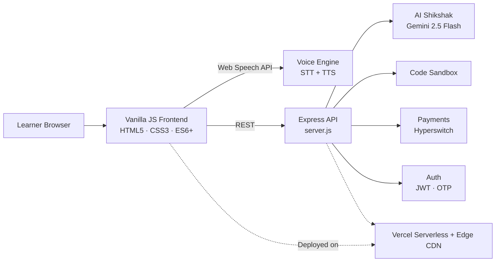

<div align="center">

# TECHINDRO

### LET'S CODE CREATE AND INNOVATE  
**EK SAPNA EK SOCH EK FUTURE VISION .**

[](https://tech-indro-official.vercel.app)
[](https://tech-indro-official.vercel.app/api/courses)
[](#)
[](#)
[](LICENSE)

[Website](https://tech-indro-official.vercel.app) · [API](https://tech-indro-official.vercel.app/api/courses) · [LinkedIn](https://www.linkedin.com/company/tech-indro/) · [YouTube](https://www.youtube.com/@TechIndro) · [GitHub](https://github.com/techindro)

</div>

---

## Why Tech Indro

Quality tech education in India is still gated by expensive hardware, scattered tools, and doubts that go unanswered for days. Tech Indro removes those barriers with one browser-based platform:

- **Learn** through structured, mentor-designed course batches.
- **Practice** in a cloud IDE and a cybersecurity sandbox, with nothing to install.
- **Get unstuck** instantly with a 24/7 voice-enabled AI tutor.
- **Build** real open-source projects through our TSOC fellowship.

---

## Product Suite

| Product | What it does |
| :--- | :--- |
| **AI Shikshak** | 24/7 voice-based doubt solver: speak your question, get a spoken answer with formatted code explanations. |
| **Course Batches** | Interactive syllabus, instructor profiles, and structured curriculum modules across 18+ flagship programs. |
| **IndroLabs Cloud IDE** | Real-time in-browser compiler for Python, JavaScript, and HTML/CSS. |
| **Test Series & Mock Exams** | Instant answer keys, percentile ranking, and deep performance analytics. |
| **Cyber Playground** | Ethical hacking sandbox with live defense simulations and vulnerability analysis. |
| **TSOC** | *Tech Season of Code*: open-source fellowship working on production repositories. |
| **Notification Center** | Live announcements, batch alerts, and mock test reminders. |

---

## TSOC: Tech Season of Code

Students contribute to real, production-grade open-source projects:

| Project | Description |
| :--- | :--- |
| [MOM-OS](https://github.com/techindro/MOM-OS) | Mind-Oriented Machine OS: an intent-driven agent layer for Linux. |
| [GhostPose](https://github.com/techindro/GhostPose-Through-Wall-Wi-Fi-3D-Sensing) | Through-wall Wi-Fi 3D sensing. |
| [ZiaLabs-AI](https://github.com/techindro/ZiaLabs-AI) | Multilingual AI research assistant and academic paper search. |
| [Chitra-AI](https://github.com/techindro/Khicho-Chatbots) | Multi-style text-to-image generator and vision studio. |

---

## Architecture



| Layer | Technology |
| :--- | :--- |
| Frontend | Zero-build Vanilla HTML5, CSS3 custom properties, ES6+ JavaScript, Lucide Icons |
| Backend | Node.js, Express.js |
| Voice | Web Speech API (`SpeechRecognition`, `SpeechSynthesis`) |
| AI | Gemini 2.5 Flash with fallback |
| Payments | Hyperswitch (UPI, cards, net banking) |
| Hosting | Vercel Serverless and Edge CDN |

---

## Security & Reliability

| Control | Implementation |
| :--- | :--- |
| **Rate limiting** | Sliding-window limits: Auth `5 req / 15 min`, AI Chat `20 req / min`, Code Execution `15 req / min` |
| **Fail-safe runtime** | Global handlers for unhandled rejections and uncaught exceptions keep the server responsive |
| **Execution sandbox** | Blocks shell escapes and malicious subprocess spawning in student code runs |
| **HTTP hardening** | Helmet, Content Security Policy, and headers against XSS, clickjacking, and MIME-sniffing |
| **Input validation** | Payload size bounds and request validation on all write endpoints |

Found a vulnerability? Please report it privately through the repository's **Security → Report a vulnerability** tab instead of opening a public issue.

---

## Quick Start

```bash
# Clone
git clone https://github.com/techindro/tech-indro-official.git
cd tech-indro-official

# Install
npm install

# Run
npm start
```

Open **http://localhost:5000** and you're live.

---

## API Reference

**Base URL:** `https://tech-indro-official.vercel.app/api`  (local: `http://localhost:5000/api`)

The same API powers the web platform and the React Native mobile app.

### Public endpoints

| Method | Endpoint | Description |
| :--- | :--- | :--- |
| `GET` | [`/courses`](https://tech-indro-official.vercel.app/api/courses) | All 18+ flagship programs with syllabus, fees, and ratings |
| `GET` | [`/courses/:id`](https://tech-indro-official.vercel.app/api/courses/ai-mastery) | Detailed curriculum and modules for one course |
| `GET` | [`/shikshak-courses`](https://tech-indro-official.vercel.app/api/shikshak-courses) | Kids and beginner coding foundation courses |
| `GET` | [`/ai-tools`](https://tech-indro-official.vercel.app/api/ai-tools) | Directory of 50+ curated AI developer tools |
| `GET` | [`/analytics`](https://tech-indro-official.vercel.app/api/analytics) | Platform traffic and visitor analytics |

### Authenticated & action endpoints

| Method | Endpoint | Description |
| :--- | :--- | :--- |
| `POST` | `/auth/register` | Student registration with validation and encryption |
| `POST` | `/auth/login` | JWT/session authentication |
| `POST` | `/auth/send-otp` | Send phone verification OTP |
| `POST` | `/auth/verify-otp` | Verify OTP and sign in |
| `POST` | `/chat` | AI Shikshak doubt engine |
| `POST` | `/compiler/run` | Sandboxed multi-language code runner |
| `POST` | `/payments/create-intent` | Create payment session (UPI, cards, net banking) |
| `POST` | `/payments/confirm` | Confirm payment and auto-enroll in course |
| `POST` | `/contact` | Rate-limited mentorship and query form |

### Try it

```bash
curl https://tech-indro-official.vercel.app/api/courses
```

```javascript
const courses = await fetch("https://tech-indro-official.vercel.app/api/courses")
  .then((res) => res.json());
console.log(courses);
```

---

## Project Structure

```
tech-indro-official/
├── index.html               # Landing page: hero, features, batch catalog
├── programs.html            # Course programs and curriculum
├── tsoc.html                # TSOC project hub
├── indrolabs.html           # Cloud IDE and in-browser compiler
├── quiz.html                # Mock test series and quiz engine
├── cyber-playground.html    # Cybersecurity and ethical hacking labs
├── bookmarks.html           # Notes, flashcards, and revision bookmarks
├── portfolio.html           # Student showcases and projects
├── server.js                # Express backend and API
├── theme-notifications.js   # Theme engine and notification center
├── styles.css               # Design tokens and animations
└── vercel.json              # Routing and edge caching headers
```

---

## Contributing

Contributions are welcome.

1. Fork the repo and create a branch: `git checkout -b feature/your-feature`
2. Commit your changes with a clear message
3. Push and open a Pull Request describing what changed and why

Looking for a place to start? Join a project through [TSOC](https://tech-indro-official.vercel.app/tsoc.html).

---

## Team

**Shubham Patel**, Founder & Architect, Tech Indro

[LinkedIn](https://www.linkedin.com/company/tech-indro/) · [YouTube](https://www.youtube.com/@TechIndro) · [GitHub](https://github.com/techindro)

---

<div align="center">

Released under the [MIT License](LICENSE) · © 2026 Tech Indro

**Built in India 🇮🇳 for every learner.**

</div>
