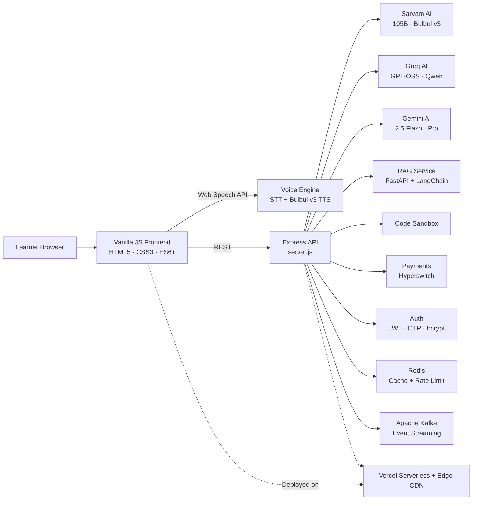

<div align="center">

# TECHINDRO

### India's 1st LLM-Based Adaptive Learning Platform  
**EK SAPNA EK SOCH EK FUTURE VISION .**

[](https://tech-indro-official.vercel.app)
[](https://tech-indro-official.vercel.app/api/courses)
[](#)
[](#)
[](#)
[](LICENSE)

[Website](https://tech-indro-official.vercel.app) · [API](https://tech-indro-official.vercel.app/api/courses) · [LinkedIn](https://www.linkedin.com/company/tech-indro/) · [YouTube](https://www.youtube.com/@TechIndro) · [GitHub](https://github.com/techindro)

</div>

---

## Why Tech Indro

Quality tech education in India is still gated by expensive hardware, scattered tools, and doubts that go unanswered for days. **Tech Indro is an LLM-Based Adaptive Learning Platform** that removes those barriers with a multi-model AI engine (Sarvam-105B, Groq, Gemini) that adapts to each learner's language, pace, and skill level:

- **Adaptive AI Mentorship** — A multi-LLM engine that detects your language (Hindi, Bhojpuri, English, 22+ Indic languages) and adapts explanations to your skill level in real time.
- **Learn** through structured, mentor-designed course batches with AI-powered doubt resolution.
- **Practice** in a cloud IDE and a cybersecurity sandbox, with nothing to install.
- **Speak & Listen** — Ask doubts by voice and hear AI responses in natural Indian voices (Sarvam Bulbul v3).
- **Get evaluated** with AI mock interviews, ATS resume scanning, and system design audits.
- **Build** real open-source projects through our TSOC fellowship.


---

## Product Suite

| Product | What it does |
| :--- | :--- |
| **AI Mentor** | 24/7 multi-engine AI tutor powered by **Sarvam-105B**, Groq, and Gemini 2.5. Speaks Hindi, Bhojpuri, and 22+ Indian languages natively. |
| **Sarvam Voice (Bulbul v3)** | Natural Indic text-to-speech with 30+ voices across 11 Indian languages. Real-time voice output for AI responses. |
| **AI Shikshak** | Voice-based doubt solver: speak your question, get a spoken answer with formatted code explanations. |
| **Course Batches** | Interactive syllabus, instructor profiles, and structured curriculum modules across 18+ flagship programs. |
| **IndroLabs Cloud IDE** | Real-time in-browser compiler for Python, JavaScript, and HTML/CSS. |
| **AI Mock Interview** | Multi-round AI-driven interview simulation with real-time evaluation and scoring. |
| **AI Resume Scanner** | ATS-powered resume analysis with actionable improvement suggestions. |
| **System Design Studio** | Interactive system architecture simulator with AI audit and review. |
| **AI Portfolio Generator** | One-click developer portfolio with AI-enhanced bio and skill showcase. |
| **Code Clash** | Real-time competitive coding battles with matchmaking and leaderboard. |
| **Test Series & Mock Exams** | Instant answer keys, percentile ranking, and deep performance analytics. |
| **Cyber Playground** | Ethical hacking sandbox with live defense simulations and vulnerability analysis. |
| **Community Forum** | Developer community with AI-assisted answers, voting, and discussions. |
| **TSOC** | *Tech Season of Code*: open-source fellowship working on production repositories. |
| **Certificate Engine** | Verifiable digital certificates with AI-generated citations and QR verification. |

---

## TSOC: Tech Season of Code

Students contribute to real, production-grade open-source projects:

| Project | Description |
| :--- | :--- |
| [MOM-OS](https://github.com/techindro/MOM-OS) | Mind-Oriented Machine OS: an intent-driven agent layer for Linux. |
| [GhostPose](https://github.com/techindro/GhostPose-Through-Wall-Wi-Fi-3D-Sensing) | Through-wall Wi-Fi 3D sensing. |
| [ZiaLabs-AI](https://github.com/techindro/ZiaLabs-AI) | Multilingual AI research assistant and academic paper search. |
| [Chitra-AI](https://github.com/techindro/Khicho-Chatbots) | Multi-style text-to-image generator and vision studio. |

---

## Architecture


```mermaid
flowchart LR
    U[Learner Browser] --> FE[Vanilla JS Frontend<br/>HTML5 · CSS3 · ES6+]
    FE -->|Web Speech API| V[Voice Engine<br/>STT + Bulbul v3 TTS]
    FE -->|REST| API[Express API<br/>server.js]
    API --> SARVAM[Sarvam AI<br/>105B · Bulbul v3]
    API --> GROQ[Groq AI<br/>GPT-OSS · Qwen]
    API --> GEMINI[Gemini AI<br/>2.5 Flash · Pro]
    API --> RAG[RAG Service<br/>FastAPI + LangChain]
    API --> SBX[Code Sandbox]
    API --> PAY[Payments<br/>Hyperswitch]
    API --> AUTH[Auth<br/>JWT · OTP · bcrypt]
    API --> REDIS[Redis<br/>Cache + Rate Limit]
    API --> KAFKA[Apache Kafka<br/>Event Streaming]
    FE -.->|Deployed on| VC[Vercel Serverless + Edge CDN]
    API -.-> VC
```

### AI Engine Stack

| Priority | Provider | Model | Best For |
| :--- | :--- | :--- | :--- |
| 0 (Primary) | **Sarvam AI** | `sarvam-105b` · `sarvam-105b-conversations` | Hindi, Hinglish, Bhojpuri & 22 Indian languages (128K context) |
| 1 | **Groq AI** | `gpt-oss-120b` · `gpt-oss-20b` · `qwen3.8-27b` | Ultra-fast English inference |
| 2 | **Google Gemini** | `gemini-2.5-flash` · `gemini-2.5-pro` | Complex reasoning & multimodal |
| 3 | **Local Fallback** | Dynamic semantic engine | Offline-resilient responses with diagrams |

### Voice Engine

| Feature | Technology |
| :--- | :--- |
| **Text-to-Speech (Indic)** | Sarvam Bulbul v3 — 11 languages, 30+ voices, adjustable pace |
| **Text-to-Speech (Browser)** | Web Speech API with intelligent Indian female voice resolver |
| **Speech-to-Text** | Web Speech API (`SpeechRecognition`) |

### Infrastructure

| Layer | Technology |
| :--- | :--- |
| Frontend | Zero-build Vanilla HTML5, CSS3 custom properties, ES6+ JavaScript, Lucide Icons |
| Backend | Node.js, Express.js, Cluster mode (4 workers) |
| AI | Sarvam AI (105B), Groq AI, Google Gemini 2.5 |
| Voice | Sarvam Bulbul v3 TTS + Web Speech API |
| RAG | Python FastAPI + LangChain microservice |
| Caching | Redis (distributed caching + sliding-window rate limiting) |
| Events | Apache Kafka (event streaming with resilient local fallback) |
| Auth | JWT + bcrypt + OTP with auto-upgrade from legacy passwords |
| Payments | Hyperswitch (UPI, cards, net banking) |
| Hosting | Vercel Serverless and Edge CDN |

---

## Security & Reliability

| Control | Implementation |
| :--- | :--- |
| **Rate limiting** | Sliding-window limits: Auth `5 req / 15 min`, AI Chat `20 req / min`, Code Execution `15 req / min` |
| **Fail-safe runtime** | Global handlers for unhandled rejections and uncaught exceptions keep the server responsive |
| **Execution sandbox** | Blocks shell escapes and malicious subprocess spawning in student code runs |
| **HTTP hardening** | Helmet, Content Security Policy, and headers against XSS, clickjacking, and MIME-sniffing |
| **Input validation** | Payload size bounds and request validation on all write endpoints |

Found a vulnerability? Please report it privately through the repository's **Security → Report a vulnerability** tab instead of opening a public issue.

---

## Quick Start

```bash
# Clone
git clone https://github.com/techindro/tech-indro-official.git
cd tech-indro-official

# Install
npm install

# Configure environment
cp .env.example .env
# Add your API keys to .env:
#   GEMINI_API_KEY    — Google AI Studio (https://aistudio.google.com/)
#   GROQ_API_KEY      — Groq Console (https://console.groq.com/keys)
#   SARVAM_API_KEY    — Sarvam Dashboard (https://dashboard.sarvam.ai/)

# Run
npm start
```

Open **http://localhost:5000** and you're live.

### Environment Variables

| Variable | Required | Description |
| :--- | :--- | :--- |
| `GEMINI_API_KEY` | Yes | Google Gemini AI for reasoning and multimodal tasks |
| `GROQ_API_KEY` | Yes | Groq AI for ultra-fast LLaMA / GPT-OSS inference |
| `SARVAM_API_KEY` | Yes | Sarvam AI for Indic LLM (105B) and Bulbul v3 TTS |
| `ADZUNA_APP_ID` / `ADZUNA_APP_KEY` | Optional | Job aggregation from Adzuna |
| `HYPERSWITCH_API_KEY` | Optional | Payment orchestration (sandbox works by default) |
| `REDIS_URL` | Optional | Redis for caching & rate limiting (defaults to `localhost:6379`) |
| `KAFKA_BROKERS` | Optional | Apache Kafka for event streaming (resilient fallback included) |
| `JWT_SECRET` | Optional | JWT auth secret (auto-generated if not set) |
| `RAG_SERVICE_URL` | Optional | FastAPI + LangChain RAG microservice URL |

---

## API Reference

**Base URL:** `https://tech-indro-official.vercel.app/api`  (local: `http://localhost:5000/api`)

The same API powers the web platform and the React Native mobile app.

### Public endpoints

| Method | Endpoint | Description |
| :--- | :--- | :--- |
| `GET` | [`/courses`](https://tech-indro-official.vercel.app/api/courses) | All 18+ flagship programs with syllabus, fees, and ratings |
| `GET` | [`/courses/:id`](https://tech-indro-official.vercel.app/api/courses/ai-mastery) | Detailed curriculum and modules for one course |
| `GET` | [`/shikshak-courses`](https://tech-indro-official.vercel.app/api/shikshak-courses) | Kids and beginner coding foundation courses |
| `GET` | [`/ai-tools`](https://tech-indro-official.vercel.app/api/ai-tools) | Directory of 50+ curated AI developer tools |
| `GET` | [`/analytics`](https://tech-indro-official.vercel.app/api/analytics) | Platform traffic and visitor analytics |
| `GET` | `/infrastructure/health` | Redis & Kafka infrastructure diagnostics |
| `GET` | `/rag/status` | FastAPI + LangChain RAG service health |

### AI & Chat endpoints

| Method | Endpoint | Description |
| :--- | :--- | :--- |
| `POST` | `/chat` | AI Mentor — multi-engine (Sarvam → Groq → Gemini) with RAG augmentation |
| `POST` | `/tts/sarvam` | Sarvam Bulbul v3 text-to-speech (11 Indian languages, 30+ voices) |
| `POST` | `/ai/certificate-citation` | AI-generated certificate citations |
| `POST` | `/ai/career-pitch` | AI-powered career pitch generator |
| `POST` | `/rag/search` | Search Tech Indro knowledge base via RAG |

### Interview & Career endpoints

| Method | Endpoint | Description |
| :--- | :--- | :--- |
| `POST` | `/interview/start` | Start AI mock interview session |
| `POST` | `/interview/respond` | Submit answer and get AI evaluation |
| `POST` | `/interview/conclude` | End session with detailed scorecard |
| `POST` | `/resume/scan` | ATS resume scanner with AI feedback |
| `POST` | `/portfolio/generate` | AI-enhanced developer portfolio generator |
| `GET` | `/portfolio/:username` | Fetch published portfolio |

### Auth & Action endpoints

| Method | Endpoint | Description |
| :--- | :--- | :--- |
| `POST` | `/auth/register` | Student registration with bcrypt encryption |
| `POST` | `/auth/login` | JWT authentication with auto bcrypt upgrade |
| `POST` | `/auth/send-otp` | Send phone verification OTP |
| `POST` | `/auth/verify-otp` | Verify OTP and sign in |
| `GET` | `/auth/me` | Get authenticated user profile |
| `POST` | `/compiler/run` | Sandboxed multi-language code runner |
| `POST` | `/system-design/simulate` | System design architecture simulator |
| `POST` | `/system-design/audit` | AI architecture audit and review |
| `POST` | `/clash/match` | Code Clash matchmaking |
| `POST` | `/contact` | Rate-limited mentorship and query form |

### Try it

```bash
# Fetch courses
curl https://tech-indro-official.vercel.app/api/courses

# Chat with AI Mentor (Hindi)
curl -X POST http://localhost:5000/api/chat \
  -H "Content-Type: application/json" \
  -d '{"message": "DSA kya hota hai?", "lang": "hi"}'

# Generate voice (Sarvam Bulbul v3)
curl -X POST http://localhost:5000/api/tts/sarvam \
  -H "Content-Type: application/json" \
  -d '{"text": "Namaste, Tech Indro mein swagat hai!", "language": "hi"}'
```

---

## Project Structure

```
tech-indro-official/
├── index.html               # Landing page: hero, features, batch catalog
├── ai-mentor.html           # AI Mentor SaaS workspace (Sarvam + Groq + Gemini)
├── programs.html            # Course programs and curriculum
├── interview-prep.html      # AI Mock Interview & Resume Scanner
├── system-design.html       # System Design Studio with AI audit
├── portfolio-generator.html # AI Portfolio Generator
├── code-clash.html          # Competitive coding battles
├── community.html           # Developer community forum
├── certificate.html         # Verifiable certificate engine
├── tsoc.html                # TSOC project hub
├── quiz.html                # Mock test series and quiz engine
├── cyber-playground.html    # Cybersecurity and ethical hacking labs
├── bookmarks.html           # Notes, flashcards, and revision bookmarks
├── dashboard.html           # Student dashboard and analytics
├── server.js                # Express backend: AI engines, auth, compiler, payments
├── female-voice.js          # Unified female TTS voice resolver
├── cookie-consent.js        # GDPR cookie consent manager
├── rag_service.py           # FastAPI + LangChain RAG microservice
├── src/
│   └── services/
│       ├── redisClient.js   # Redis distributed caching & rate limiting
│       └── kafkaClient.js   # Apache Kafka event streaming
├── style.css                # Design tokens and animations
├── .env.example             # Environment variable template
└── vercel.json              # Routing and edge caching headers
```

---

## Contributing

Contributions are welcome.

1. Fork the repo and create a branch: `git checkout -b feature/your-feature`
2. Commit your changes with a clear message
3. Push and open a Pull Request describing what changed and why

Looking for a place to start? Join a project through [TSOC](https://tech-indro-official.vercel.app/tsoc.html).

---

## Team

**Shubham Patel**, Founder & Architect, Tech Indro

[LinkedIn](https://www.linkedin.com/company/tech-indro/) · [YouTube](https://www.youtube.com/@TechIndro) · [GitHub](https://github.com/techindro)

---

<div align="center">

Released under the [MIT License](LICENSE) · © 2026 Tech Indro

**Built in India 🇮🇳 for every learner.**

</div>
