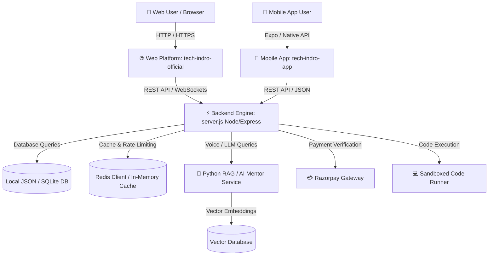

# 🏛️ TECH INDRO — System Architecture (`ARCHITECTURE.md`)

> **Tech Indro Ecosystem Architecture & Technical Blueprint**  
> *A comprehensive guide covering every component, folder structure, and data flow.*

---

## 🌟 1. High-Level System Overview

Tech Indro is a unified EdTech & AI Learning Ecosystem engineered across three primary layers:

1. **🌐 Web Platform (`tech-indro-official`)**:
   - Zero-build Vanilla ES6+, CSS3, modern Progressive Web App (PWA).
   - Instant loading, SEO optimized, interactive portals (AI Shikshak, IndroLabs, TSOC, Flagship Courses).
2. **📱 Cross-Platform Mobile App (`tech-indro-app`)**:
   - Universal React Native + Expo (SDK 52/53) powered by Expo Router.
   - Ready for Android APK generation, iOS devices, and Web export.
3. **⚡ Backend & Security API (`server.js` & `rag_service.py`)**:
   - Node.js Express runtime with enterprise-grade Anti-Crash Protection and WAF security.
   - Python FastAPI/RAG service for vector embeddings and intelligent doubt resolution.
   - Razorpay payment gateway integration, JWT authentication, and isolated sandboxed code execution.



---

## 📂 2. Repository & Directory Structure

```
tech-indro-website/
├── docs/                               # 📚 Complete System Documentation
│   ├── ARCHITECTURE.md                 # System blueprints, data flow & file maps
│   ├── DESIGN.md                       # Design system, themes & UI guidelines
│   ├── MEMORY.md                       # Project memory, configurations & fix history
│   ├── PRD.md                          # Product requirements & feature specs
│   ├── RULES.md                        # Coding standards, security & dev rules
│   └── TASKS.md                        # Task board, progress & future roadmap
│
├── tech-indro-official/                # 🌐 Web Platform & Primary Backend
│   ├── server.js                       # Core Express Backend API (Port 5000/3000)
│   ├── rag_service.py                  # Python AI/RAG engine for doubt resolution
│   ├── index.html                      # Landing page & ecosystem entry point
│   ├── programs.html                   # Flagship masterclasses & programs catalog
│   ├── shikshak.html / rohini.html     # AI Shikshak (Voice & chat doubt assistant)
│   ├── playground.html                 # IndroLabs in-browser multi-language compiler
│   ├── tsoc.html                       # Tech Season of Code project showcase
│   ├── hiring.html / jiva-hr.html      # JIVA Autonomous Agentic AI HR & Hiring Portal
│   ├── community.html                  # Peer-to-Peer Chat & Doubt Hub with AI Auto-Assist
│   ├── certificate.html                # Dynamic certificate verification & download
│   ├── style.css                       # Global design system & responsive styling
│   ├── main.js                         # Core client-side interactions
│   └── src/services/                   # Backend services (Redis, email, payment)
│
└── tech-indro-app/                     # 📱 Mobile App (React Native / Expo)
    ├── src/
    │   ├── app/                        # Expo Router file-based screens
    │   │   ├── (tabs)/                 # Tab navigation (Home, Courses, Labs, Profile)
    │   │   ├── _layout.tsx             # Root layout & context providers
    │   │   ├── index.tsx               # Splash / Launch screen
    │   │   └── indrolabs.tsx           # Mobile code playground
    │   ├── components/                 # Reusable UI components (Cards, Headers, Buttons)
    │   └── theme/                      # Mobile color palettes & typography tokens
    ├── android/                        # Native Android project (Gradle, CMake, NDK)
    ├── app.json                        # Expo project configuration
    └── eas.json                        # EAS cloud build settings for APK generation
```

---

## 🔄 3. Data Flow & Communication Lifecycle

### A. Authentication Flow
1. User submits login or registration credentials (`/api/auth/login`).
2. Server validates credentials against user records and issues a signed **JWT (JSON Web Token)**.
3. Web client stores the token in `localStorage` / HTTP-only cookies; Mobile client stores it securely using `SecureStore`.
4. Subsequent authenticated requests attach `Authorization: Bearer <token>` in HTTP headers.

### B. AI Shikshak (Doubt Solving) Flow
1. Student inputs a query via voice (microphone) or text prompt.
2. Client forwards the query to the backend endpoint `/api/ai/ask`.
3. `server.js` verifies rate limits and forwards the prompt to `rag_service.py` or the configured LLM API (Groq / Gemini).
4. The RAG service performs vector similarity search across course materials and code snippets for relevant context.
5. The synthesized solution (with formatted code blocks and explanations) is returned to the user with audio playback.

### C. IndroLabs Playground (Cloud Compiler) Flow
1. User writes Python, JavaScript, or HTML/CSS code and clicks **Run**.
2. Code payload is dispatched to `/api/execute`.
3. Node.js backend launches an isolated sandbox child process configured with:
   - Maximum execution timeout: **5000ms (5 seconds)**.
   - Restricted memory limits to prevent CPU exhaustion or infinite loops.
4. Process output (`stdout`/`stderr`) is returned in structured JSON and rendered in the editor terminal.

---

## 🛠️ 4. Technology Stack Breakdown

| Layer | Technology | Key Advantage |
| :--- | :--- | :--- |
| **Frontend Web** | Vanilla HTML5, CSS3, ES6+ | Zero build overhead, instant page loads, best-in-class SEO |
| **Mobile App** | React Native, Expo, TypeScript | Single codebase for Android & iOS with buttery-smooth 60 FPS |
| **Backend API** | Node.js, Express.js | High concurrency, lightweight, extensive ecosystem for streaming |
| **AI / RAG Service** | Python, FastAPI, LangChain/Chroma | Robust support for vector databases, embeddings, and prompt orchestration |
| **Database & Cache** | Local JSON Store / Redis | Low-latency response times with reliable caching fallback |
| **Payment Gateway** | Razorpay SDK | Instant UPI, QR Code, Net Banking, and Card checkout support across India |

---

## 💡 5. Plain English Architectural Summary

> **How the entire ecosystem works together:**
> 
> 1. When a student opens the platform in a web browser, files are delivered from **`tech-indro-official`**.
> 2. When a student uses their mobile phone, the **`tech-indro-app`** (built with React Native and Expo) handles the native user experience.
> 3. Both Web and Mobile clients talk to the same unified Node.js backend (**`server.js`**) for authentication, courses, compiler execution, and payments.
> 4. For AI-assisted learning (AI Shikshak), the Python service (**`rag_service.py`**) retrieves context and generates step-by-step guidance.
> 5. Security safeguards (WAF, rate limiting, and sandbox limits) ensure stability against traffic spikes and malicious code execution.
